# 💈 HOLIC Barbershop — Sistem Antrean Online

Aplikasi manajemen antrean barbershop berbasis web: customer ambil antrean dari HP, check-in via QR di loket, pantau status real-time, terima push notifikasi saat dipanggil. Admin mengelola seluruh operasional dari loket hingga rekap kinerja.

**Stack:** Laravel 11 · Blade · MySQL 8 · Tailwind CSS (CDN) · Web Push (VAPID) · Brevo HTTP API (OTP email) · PWA · Railway (production)

**Production:** `https://holic-barbershop-production-52f2.up.railway.app`

---

## 📸 Tangkapan Layar

### Halaman Publik — Landing Page
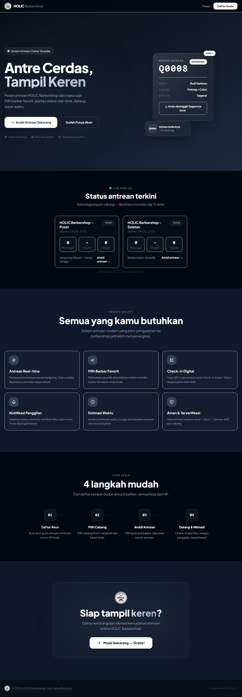
Halaman depan lengkap (7 section): headline "Antre Cerdas, Tampil Keren" + tombol "Ambil Antrean Sekarang" + mockup kartu antrean live (Q0008 DIPANGGIL), status antrean terkini per cabang (auto-refresh 15 detik), 6 kartu fitur, 4 langkah cara kerja, CTA penutup, dan footer.

### Login
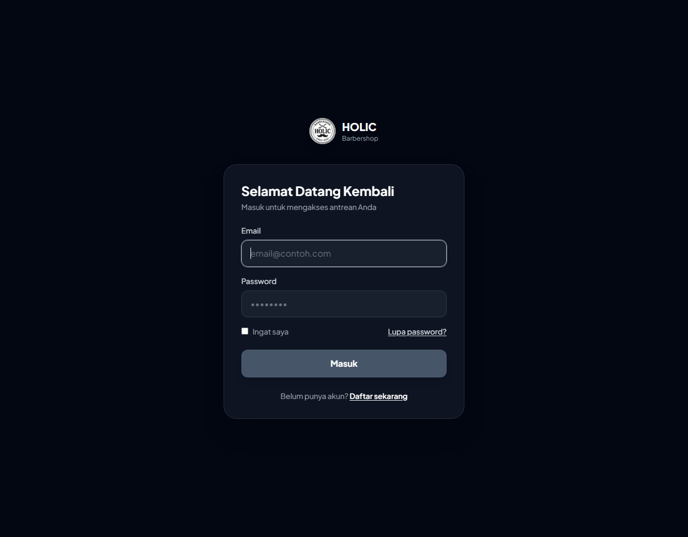
Form masuk dark-mode di tengah layar: kolom email + password, opsi "Ingat saya", link "Lupa password?", dan tombol Masuk. Belum punya akun? Link "Daftar sekarang".

### Pendaftaran
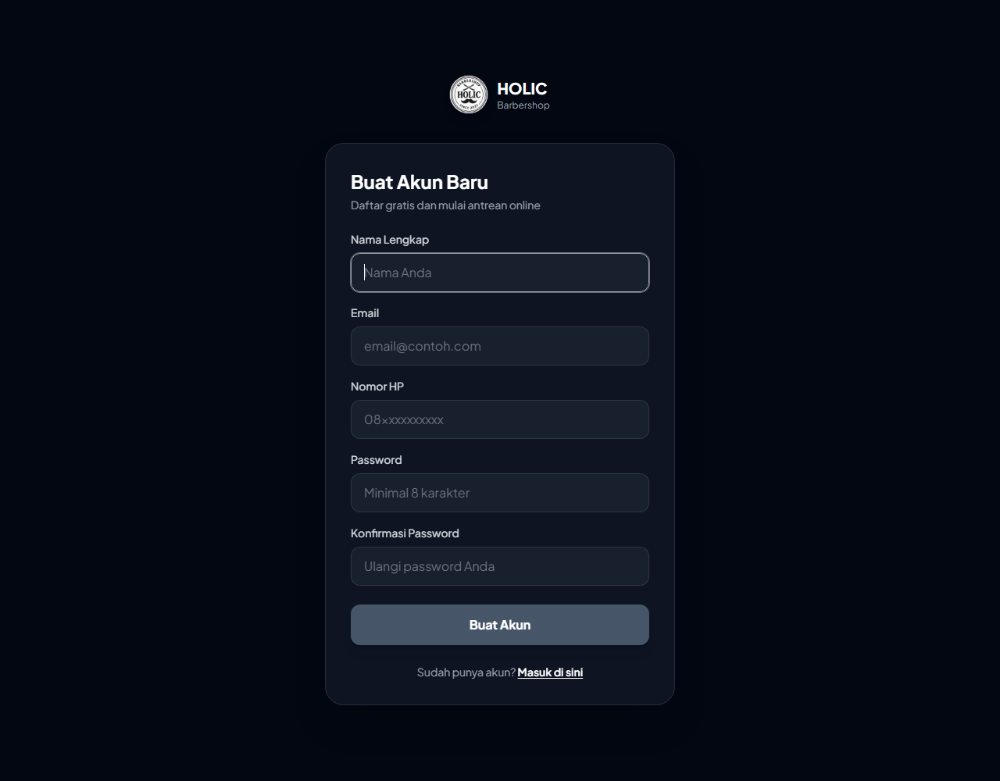
Form daftar akun gratis (nama, email, nomor HP, password). Setelah daftar, kode OTP 6 digit langsung dikirim ke email — akun wajib verifikasi email sebelum bisa antre.

### Lupa Password (OTP via Email)
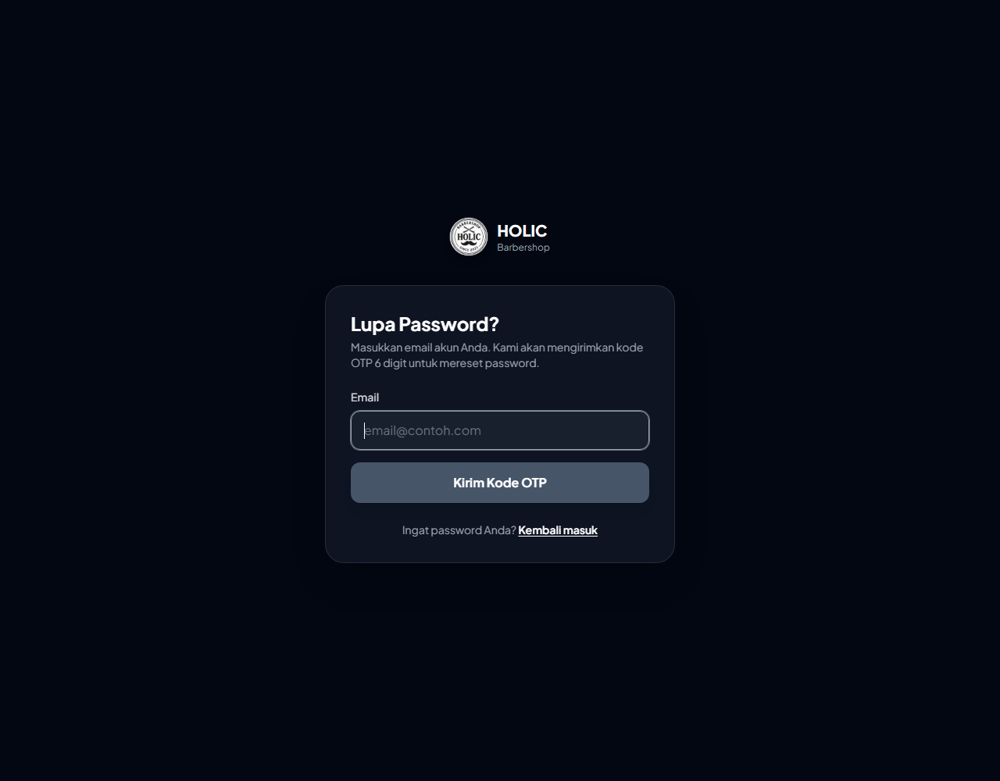
Masukkan email akun → kode OTP 6 digit dikirim via Brevo (gratis 300 email/hari, ke semua tujuan). Berlaku 10 menit, maksimal 5x salah, tombol kirim ulang dengan cooldown 60 detik.

### Dashboard Customer
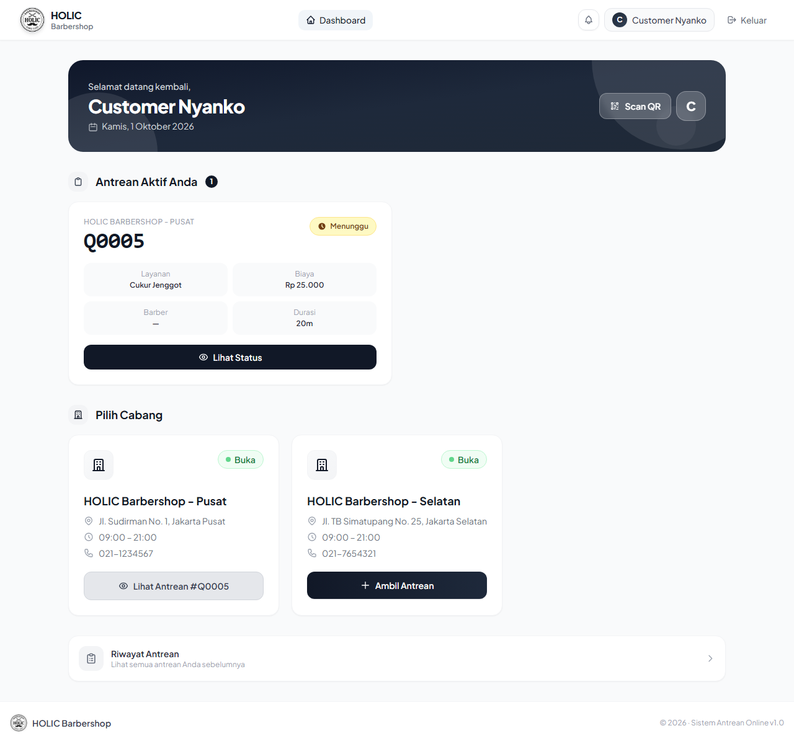
Sambutan + tanggal hari ini, tombol Scan QR untuk check-in, daftar kartu cabang (nama, alamat, jam, telepon, badge Buka/Tutup), dan kartu Riwayat Antrean. Tombol "Ambil Antrean" berubah menjadi "Tutup · Buka 09:00–21:00" (nonaktif) di luar jam operasional.

### Status Antrean (Detail)
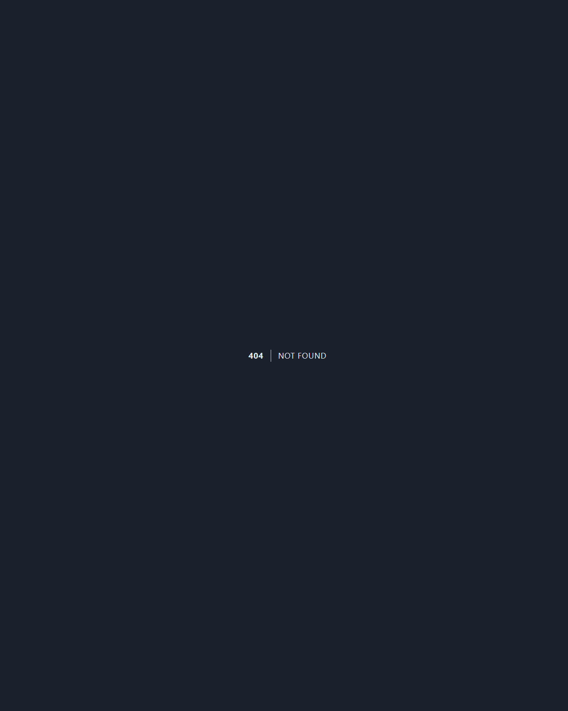
Contoh antrean Q0001 yang sudah selesai: nomor besar + badge status, info barber / layanan+durasi / biaya / cabang / tanggal, timeline lengkap (dibuat → check-in tervalidasi → dipanggil → selesai), dan tombol Kembali ke asal (riwayat/dashboard). Saat antrean masih aktif, tampil tambahan kartu live: Saat Ini, Posisi, Di Depan, Est. Tunggu.

### Riwayat Antrean Customer
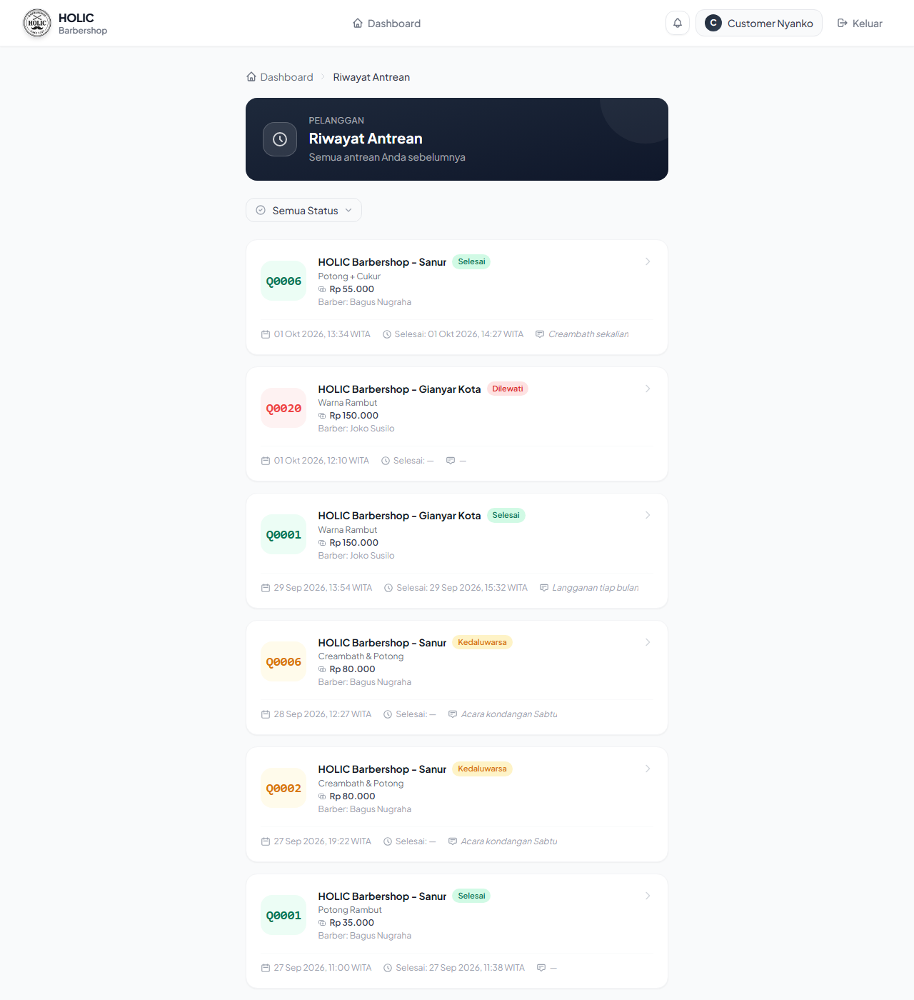
Daftar kartu antrean sebelumnya (contoh: 6 antrean, 5 Selesai + 1 Dilewati) dengan filter status. Setiap kartu bisa diklik menuju halaman detail. Tercantum layanan + biaya, barber, waktu ambil, dan waktu selesai (tanggal + jam).

### Dashboard Admin
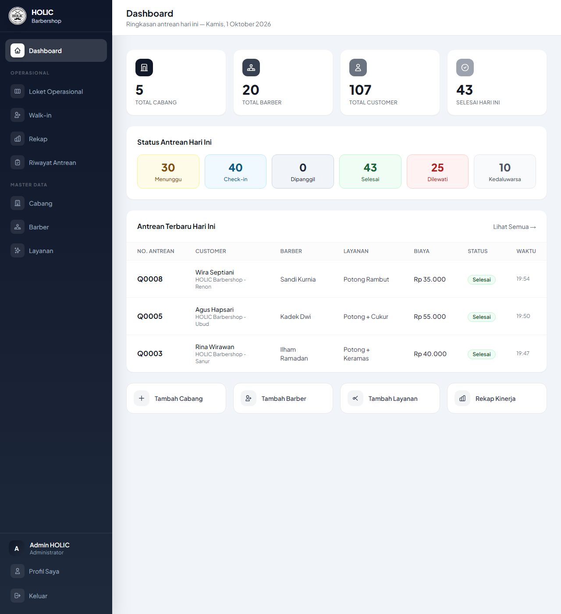
Ringkasan hari ini: total cabang / barber / customer / selesai, 6 kotak status antrean (Menunggu, Check-in, Dipanggil, Selesai, Dilewati, Kedaluwarsa), tabel antrean terbaru, dan tombol aksi cepat (Tambah Cabang/Barber/Layanan, Rekap Kinerja).

### Loket Operasional
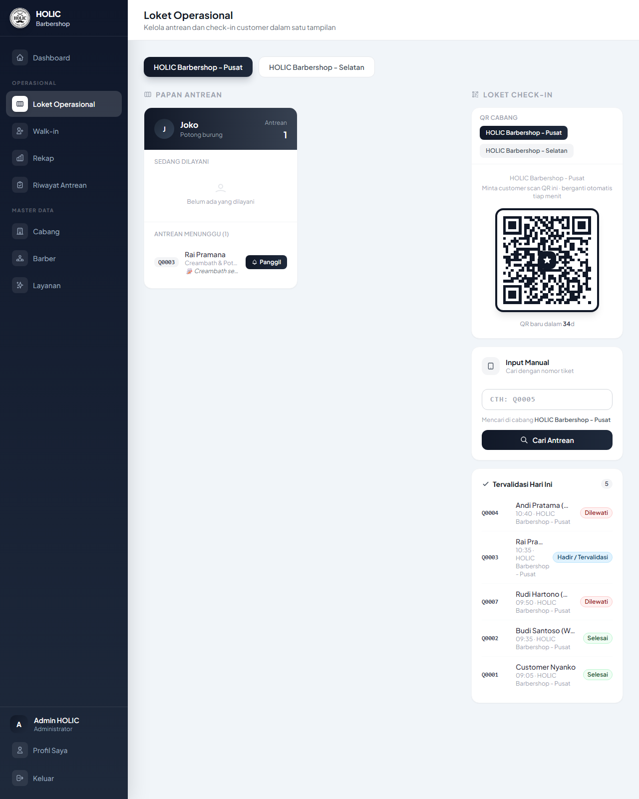
Satu layar untuk seluruh operasional cabang: papan antrean per barber (Sedang Dilayani + Menunggu, lengkap dengan catatan customer), QR check-in cabang yang berganti otomatis tiap menit (countdown "QR baru dalam …"), Input Manual (cari nomor tiket, terkunci di cabang aktif), dan daftar Tervalidasi Hari Ini. Banner merah muncul bila cabang tutup — antrean baru diblokir, antrean sisa tetap bisa diselesaikan.

### Walk-in
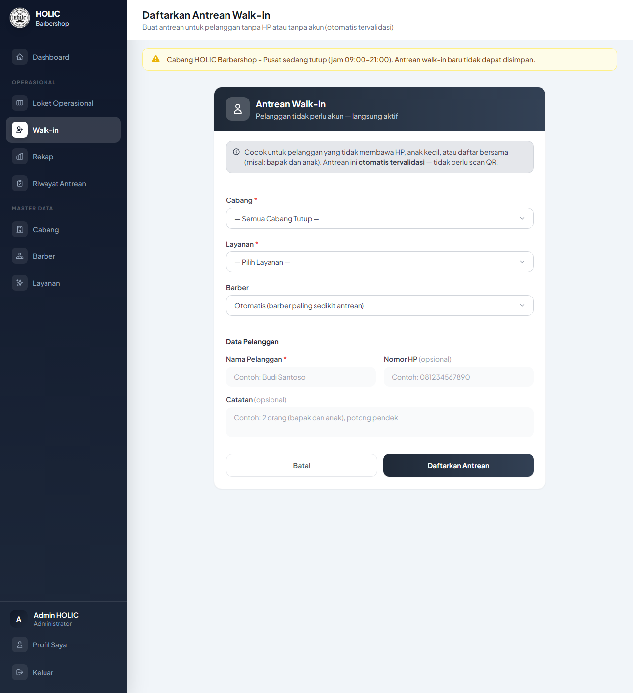
Form admin untuk mendaftarkan pelanggan tanpa HP/akun (langsung tervalidasi, tanpa scan QR). Dropdown cabang hanya berisi cabang yang buka; pilihan layanan/barber terkunci hingga cabang dipilih. Banner kuning memblokir simpan saat cabang tutup.

### Riwayat Antrean (Admin)
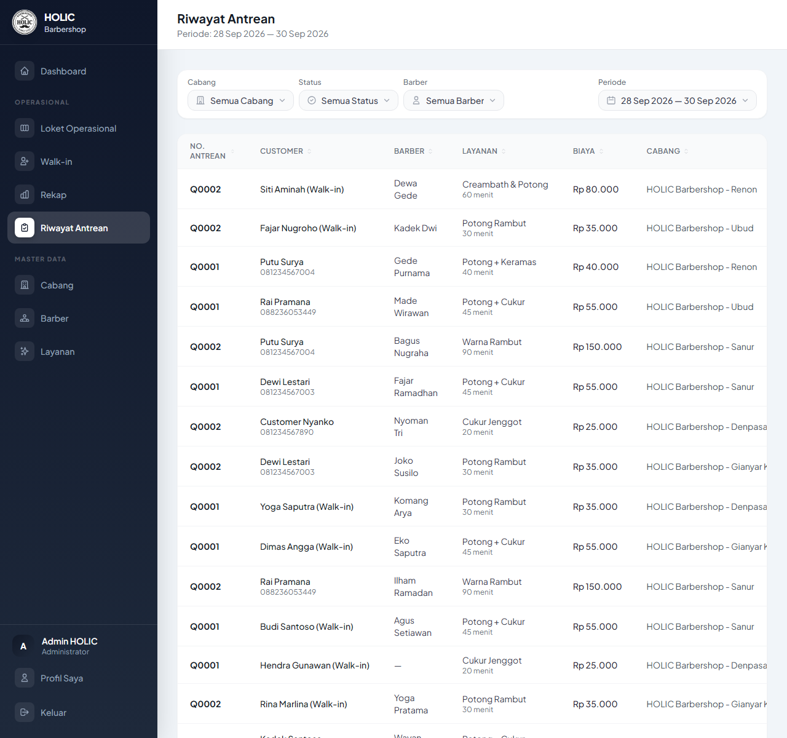
Tabel seluruh antrean dengan filter cabang / status / barber / periode tanggal dan 9 kolom yang bisa di-sort (termasuk Selesai). Setiap baris bisa diklik menuju halaman detail lengkap (customer, barber, layanan+durasi, biaya, cabang, tanggal, timeline, catatan).

### Rekap Kinerja
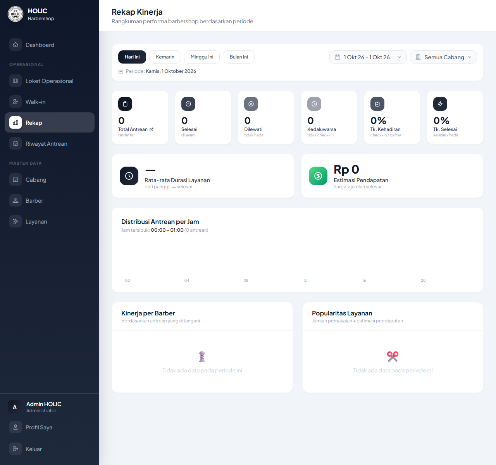
Laporan performa per periode (Hari Ini/Kemarin/Minggu Ini/Bulan Ini + rentang tanggal + cabang): total antrean, selesai, dilewati, kedaluwarsa, tingkat kehadiran & penyelesaian, rata-rata durasi layanan, estimasi pendapatan, grafik distribusi per jam, kinerja per barber, dan popularitas layanan.

---

## ✨ Fitur Lengkap

### 👤 Customer
- Register & login, **wajib verifikasi email via OTP 6 digit** (Brevo) sebelum bisa antre
- Lupa password via OTP email (10 menit, max 5x salah, cooldown kirim ulang 60 detik)
- Pilih cabang (badge Buka/Tutup live, polling 15 detik) — **tidak bisa antre di luar jam operasional**
- Pilih layanan (nama + durasi + biaya) dan barber (manual / otomatis paling luang)
- Nomor antrean harian per cabang (`Q0001…`, reset tiap hari)
- Check-in digital: scan QR loket (berganti tiap 60 detik) atau input manual di loket
- Status antrean real-time: posisi, jumlah di depan, estimasi tunggu, nomor sedang dilayani
- **Push notifikasi**: saat dipanggil, selesai, dilewati + peringatan bertingkat saat tinggal 3, 2, 1 antrean di depan (termasuk yang belum check-in)
- Popup pertama-kali untuk mengaktifkan notifikasi + halaman profil (edit data, ganti password)
- Riwayat antrean: kartu bisa diklik ke detail lengkap (biaya, cabang, tanggal, timeline, catatan)
- 1 akun = 1 antrean aktif per cabang; pending kedaluwarsa otomatis 60 menit

### 🔧 Admin / Loket
- Dashboard statistik harian + tabel antrean terbaru
- **Loket Operasional**: papan antrean per barber, QR check-in berputar, input manual tanpa pilih cabang (terkunci konteks), cabang tutup disembunyikan (banner + badge)
- **Walk-in**: daftarkan pelanggan tanpa akun (langsung tervalidasi), dropdown hanya cabang buka, layanan/barber terkunci hingga cabang dipilih
- Aksi antrean: panggil → selesai / lewati, validasi kehadiran (QR + manual)
- **Riwayat Antrean**: filter cabang/status/barber/periode, 9 kolom sortable (termasuk waktu Selesai), baris bisa diklik ke detail
- **Rekap Kinerja**: metrik, grafik per jam, kinerja barber, popularitas layanan, estimasi pendapatan
- **Master data**: CRUD Cabang (jam operasional + prefix nomor), Barber (ketersediaan), Layanan (durasi + biaya) — semua dengan sort & filter
- Guard hapus: cabang/barber/layanan yang masih punya relasi tidak bisa dihapus

---

## 🔄 Alur Bisnis

```
[Daftar] → [OTP email] → [Login] → [Pilih Cabang + Layanan + Barber]
→ [PENDING] → [Check-in QR/manual] → [ACTIVE]
→ [Dipanggil] → [CALLED] → [Selesai] → [COMPLETED]
                              ↘ [Dilewati] → [SKIPPED]
[PENDING 60 mnt tanpa check-in] → [EXPIRED] (scheduler tiap menit)
[CALLED 15 mnt tanpa selesai] → [SKIPPED] (scheduler tiap menit)
```

- **Nomor antrean** (`Branch::getNextQueueNumber()`): format `QXXXX` urut per cabang per hari, dikunci transaksi + unique index anti-duplikat.
- **Auto-assign barber**: antrean menunggu paling sedikit → bila sama, yang paling sedikit melayani hari ini.
- **Guard jam operasional** (`Branch::isOpen()`, dukung lewat tengah malam, tanpa jam = selalu buka): berlaku di form customer (`take`+`store`), walk-in (`create`+`store`), tombol dashboard, badge, dan dropdown (server sebagai backstop, bukan hanya tombol disabled).
- **Notifikasi near bertingkat**: kolom `notified_near_level` menyimpan level tertinggi yang sudah dikirim (3→2→1), tembak sekali per level untuk antrean `pending/active/called`.
- **QR berputar**: token acak per cabang per slot 60 detik di cache; slot saat ini + sebelumnya diterima (toleransi scan); papan loket refresh via JSON tiap 60 detik.

## 🗄️ Skema Database (MySQL)

| Tabel | Kolom | Keterangan |
|---|---|---|
| `users` | id, name, email (unique), email_verified_at, password, role (`admin/customer`), phone, remember_token | Akun; customer wajib `email_verified_at` terisi |
| `branches` | id, name, address, phone, city, description, open_time/close_time (`H:i`), is_active, queue_prefix | Cabang + jam operasional |
| `barbers` | id, branch_id → branches, name, phone, specialty, bio, photo, is_available | Kapster per cabang |
| `services` | id, branch_id → branches, name, description, duration_minutes, price, is_active | Layanan + biaya per cabang |
| `queues` | id, queue_number, customer_id → users (null = walk-in), barber_id → barbers (null ok), service_id → services, branch_id → branches, status (`pending/active/called/completed/skipped/expired`), notes, guest_name, guest_phone, validation_token (unique), estimated_start, checked_in_at, called_at, completed_at, expired_at, notified_near_at, notified_near_level (3/2/1), timestamps | Inti antrean; unique (branch_id, queue_number, tanggal) |
| `password_reset_otps` | id, email (null ok), phone (null ok), code_hash (bcrypt), attempts (max 5), expires_at (+10 mnt) | OTP reset password & verifikasi email |
| `push_subscriptions` | id, user_id → users, endpoint (unique per user), public_key, auth_token, content_encoding | Endpoint Web Push per perangkat |
| `sessions`, `cache`, `jobs`, `failed_jobs` | bawaan Laravel | Sesi DB, cache, antrean kerja |

Relasi Eloquent: `Branch hasMany Barber/Service/Queue`; `Barber belongsTo Branch`; `Service belongsTo Branch`; `Queue belongsTo Customer(User)/Barber/Service/Branch`; `User hasMany Queue/PushSubscription`.

---

## 📁 Struktur Project

```
holic-barbershop/
├── app/
│   ├── Concerns/Sortable.php              # trait sort whitelist + tiebreaker id
│   ├── Console/Commands/
│   │   ├── ExpirePendingQueues.php        # queues:expire-pending (60 mnt)
│   │   └── AutoSkipCalledQueues.php       # queues:auto-skip (called 15 mnt)
│   ├── Http/
│   │   ├── Controllers/
│   │   │   ├── HomeController.php         # landing + live-status JSON (publik)
│   │   │   ���── ProfileController.php      # profil + ganti password
│   │   │   ├── PushSubscriptionController.php  # subscribe/unsubscribe/test-event
│   │   │   ├── Auth/                      # login, register+OTP, verifikasi email,
│   │   │   │                              # lupa password OTP, password baru
│   │   │   ├── Customer/QueueController.php    # dashboard, take, store,
│   │   │   │                              # status, poll JSON, history, scanCheckin
│   │   │   └── Admin/                     # Dashboard, Branch, Barber, Service,
│   │   │                                  # Queue (riwayat+loket+aksi), Checkin,
│   │   │                                  # WalkinQueue, Rekap
│   │   └── Middleware/
│   │       ├── RoleMiddleware.php         # gate role admin/customer
│   │       ├── EnsureEmailVerified.php    # wajib OTP sebelum antre
│   │       └── SecurityHeaders.php        # Permissions-Policy camera=(self) + lain
│   ├── Jobs/
│   │   ├── SendPasswordResetOtp.php       # kirim OTP via Brevo (ShouldQueue)
│   │   └── SendQueuePushNotification.php  # push called/completed/skipped/near
│   ├── Models/                            # User, Branch, Barber, Service,
│   │                                      # Queue, PasswordResetOtp, PushSubscription
│   └── Services/
│       ├── BrevoMailService.php           # POST api.brevo.com/v3/smtp/email
│       ├── PasswordResetOtpService.php    # issue/verify/cooldown OTP
│       └── WebPushService.php             # kirim push, hapus hanya 404/410
├── bootstrap/app.php                      # registrasi middleware + alias
├── config/services.php                    # kredensial brevo.* + vapid
├── database/migrations/ (16 file)         # lihat tabel di atas
├── docs/
│   ├── RANGKUMAN-UPDATE.md / RANGKUMAN-AWAM.md
│   └── screenshots/ (12 PNG didokumentasikan di atas)
├── public/
│   ├── sw.js                              # service worker push (cache holic-v2)
│   ├── manifest.webmanifest               # PWA + VAPID public key
│   └── favicon.ico, icon-192/512.png …    # ikon dari logo 1080px (GD)
├── resources/views/
│   ├── layouts/ (app, admin, auth)        # nav, bell push, popup, flash tunggal
│   ├── components/                        # filter-dropdown(+script), sort-th,
│   │                                      # auth-input, otp-resend, qr-scanner
│   ├── auth/ (login, register, forgot-password, verify-otp,
│   │          verify-email, new/reset-password) + errors/419.blade.php
│   ├── customer/ (dashboard, queue/take, queue/status, queue/history)
│   ├── admin/ (dashboard, branches, barbers, services,
│   │           queues/index|manage|show|walkin, rekap, checkin/confirm)
│   └── profile/edit.blade.php
├── routes/web.php                         # 73 route (guest/auth/admin/customer)
├── railway.toml                           # migrate+seed+cache+worker+serve
└── .env.example                           # Brevo-only + VAPID (tanpa SMTP/Resend)
```

---

## 🧩 Fungsi Kode Penting

| Lokasi | Fungsi | Peran |
|---|---|---|
| `Branch::isOpen(?at)` | cek jam operasional (lewat tengah malam ok, tanpa jam = buka) | Satu-satunya sumber kebenaran guard jam |
| `Branch::getNextQueueNumber()` | nomor urut harian per cabang (lock + unique) | Anti nomor ganda |
| `Queue::position_in_queue` / `ahead_count` / `newlyNear()` | posisi, sisa di depan, level near baru | Dasar estimasi + push 3-2-1 |
| `QueueController@store` (Customer) | guard tutup + 1 aktif/cabang + auto-assign `[pending, served]` | Ambil antrean |
| `QueueController@call/complete/skip` (Admin) | transisi status + `Bus::dispatchSync` push | Aksi loket |
| `CheckinController@search/confirm/validate_checkin` | cari tiket (default cabang sesi) → konfirmasi token → aktif | Check-in QR + manual |
| `WalkinQueueController@create/store` | dropdown cabang buka saja + guard simpan | Walk-in |
| `RekapController@index` | agregasi `groupBy barber_id,status` 1 query + metrik | Laporan |
| `PasswordResetOtpService::issue/verify/resendCooldownRemaining` | OTP bcrypt 10 mnt / 5x / 3 aktif / cooldown 60 d | OTP |
| `BrevoMailService::sendOtp(..., purpose)` | subject per-purpose (verify vs reset) | Email OTP |
| `SendQueuePushNotification` | payload queue_number/event/url, null-safe barber | Push antrean |
| `WebPushService::sendToUser` | hapus endpoint hanya saat 404/410 (403 dipertahankan) | Hygiene push |
| `EnsureEmailVerified` | redirect belum-verifikasi ke `verification.notice` | Wajib OTP |
| `Sortable` trait + `sort-th` + `filter-dropdown(+script)` | sort whitelist + dropdown tema ganda (filter/form, reload/noreload) | Listing seragam |
| `queues:expire-pending` / `queues:auto-skip` | scheduler tiap menit | Kedaluwarsa otomatis |
| `HomeController@live` | agregat counts + open/closed per cabang (tanpa data user) | Live publik 15 dtk |

---

## 🛠️ Persyaratan Sistem

| Komponen | Versi |
|---|---|
| PHP | 8.2+ |
| Composer | 2.x |
| MySQL | 8.0+ |
| Kunci Brevo (`BREVO_API_KEY`, pengirim terverifikasi) | untuk OTP email |
| Kunci VAPID (`VAPID_PUBLIC/PRIVATE_KEY`) | untuk Web Push |

---

## 🚀 Cara Menjalankan

### 1. Install PHP & Composer

**Windows** — gunakan [Laragon](https://laragon.org/download/) (sudah termasuk PHP 8.2, MySQL, Composer dalam satu installer).

### 2. Install Dependencies

```bash
cd E:\Documents\Code\holic-barbershop
composer install
```

### 3. Setup Environment

```bash
copy .env.example .env
php artisan key:generate
```

Isi di `.env`: `DB_*` (lokal), `BREVO_API_KEY` + `BREVO_FROM_EMAIL` (email pengirim yang sudah diverifikasi di Brevo), `VAPID_PUBLIC_KEY` + `VAPID_PRIVATE_KEY` (generate sekali via `php artisan webpush:generate-keys` bila tersedia, atau layanan VAPID), `APP_URL` (URL publik, wajib benar untuk link & QR).

### 4. Konfigurasi Database

```sql
CREATE DATABASE holic_barbershop;
```

### 5. Migration & Seed

```bash
php artisan migrate --seed
```

### 6. Jalankan + Worker Antrean (lokal, 2 terminal)

```bash
php artisan serve
php artisan queue:work --sleep=3 --tries=3
php artisan schedule:work   # opsional: expire/skip otomatis tiap menit
```

Buka: **http://127.0.0.1:8000**

> MySQL Laragon tidak auto-start setelah reboot — bila semua halaman 500 + `SQLSTATE … sessions`, jalankan `mysqld.exe --defaults-file="C:/laragon/bin/mysql/mysql-8.4.3-winx64/my.ini"`, tunggu ±15 detik, lalu refresh.

### Deploy (Railway)

`railway.toml` otomatis: `migrate --force` → `db:seed --force` → `optimize:clear` → `config/route/view:cache` → `queue:work` background → `serve 0.0.0.0:$PORT`. Variabel wajib di Railway: `APP_*`, `DB_*` (internal `mysql.railway.internal`), `BREVO_*`, `VAPID_*`, `QUEUE_CONNECTION=database`. Tunggu ±3 menit setelah push, verifikasi via `/health` (200 + DB ok) dan `/live-status`.

---

## 🔑 Akun Demo (lokal, via seeder)

| Role | Email | Password |
|---|---|---|
| Admin | admin@holic.com | password |
| Customer | customer@demo.com | password |

> Kredensial production berbeda dan tidak didokumentasikan di sini.

---

## 🐛 Troubleshooting

| Gejala | Penyebab | Solusi |
|---|---|---|
| Semua halaman 500 + `SQLSTATE … sessions` / `Can't connect (10061)` | MySQL mati (umum setelah reboot) | Jalankan `mysqld.exe` manual (lihat di atas), tunggu ±15 detik |
| `No application encryption key` | `.env` tanpa APP_KEY | `php artisan key:generate` |
| `Unknown database` | DB belum dibuat | `CREATE DATABASE holic_barbershop;` |
| `Class not found` | autoload basi | `composer dump-autoload` |
| 403 di halaman role lain | Salah role / sesi campur | Login ulang dengan akun role yang sesuai (cookie jar terpisah saat testing) |
| 419 Page Expired massal | Sesi DB hilang (DB restart) / token basi | Pastikan DB hidup, refresh form sebelum submit |
| QR/scan `NotAllowedError` | Izin kamera / origin tidak aman | Buka via HTTPS atau localhost, izinkan kamera, gunakan fallback upload foto + tombol ulangi |
| Push tidak masuk di HP | Subscription basi / permission | Buka dashboard (self-heal re-register), izinkan notifikasi, endpoint uji `push/test-event` |
| OTP tidak masuk | API key / pengirim Brevo | Cek `BREVO_API_KEY`, pastikan `BREVO_FROM_EMAIL` terverifikasi di Brevo, cek antrean `jobs` + worker hidup |
| Deploy Railway belum berubah | Redeploy ±3 menit | Tunggu, lalu cek `/health` + marker konten sebelum menyimpulkan |
